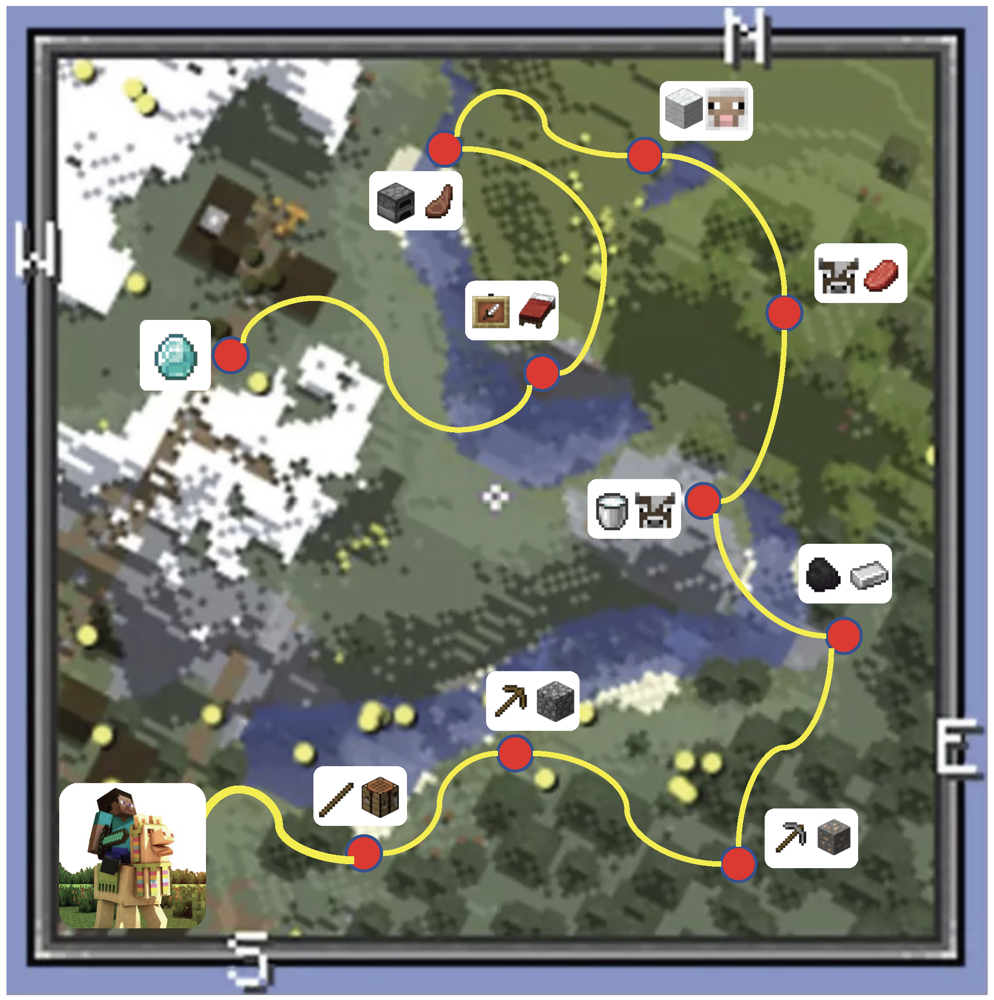

#  LLaMA-Rider: Spurring Large Language Models to Explore the Open World

[[Arxiv Paper]](https://arxiv.org/abs/2310.08922)

---




**LLaMA-Rider** is a two-stage learning framework that spurs Large Language Models (LLMs) to explore the open world and learn to accomplish multiple tasks. This repository contains the implementation of **LLaMA-Rider** in the sandbox game Minecraft, and the code is largely based on the [Plan4MC](https://github.com/PKU-RL/Plan4MC) repository.

## Installation

The installation of MineDojo and Plan4MC is the same as that in the [Plan4MC](https://github.com/PKU-RL/Plan4MC) repository:

- Install MineDojo environment following the [official document](https://docs.minedojo.org/sections/getting_started/install.html#prerequisites).  It requires python >= 3.9. We install jdk 1.8.0_171.

- Upgrade the MineDojo package: 
  - Delete the original package `pip uninstall minedojo`.
  
  - Download the [modified MineDojo](https://github.com/PKU-RL/MCEnv). Run `python setup.py install`.

  - Download the [pretrained MineCLIP model](https://disk.pku.edu.cn:443/link/86843F120DF784DCC117624D2E90A569) named `attn.pth`.  Move the file to `mineclip_official/`.
  
  - To this end, you can successfully run `validate_install.py` [here](https://github.com/MineDojo/MineDojo/tree/main/scripts).
  
    - if you are on a headless machine, please use the following command to verify if the installation was successful:
  
      ```shell
      xvfb-run python minedojo/scripts/validate_install.py
      ```
  
- Install python packages in `requirements.txt`. Note that we validate our code with PyTorch=2.0.1 and x-transformers==0.27.1. 

  ```shell
  pip install -r requirements.txt
  ```

## Method overview


**LLaMA-Rider** is a two-stage framework:

* Exploration stage: LLM explores the open world with the help of the environmental feedback, where a feedback-revision mechanism helps the LLM revise its previous decisions to align with the environment
* Learning stage: The experiences collected during exploration stage are processed into a supervised dataset and used for supervised fine-tuning (SFT) of the LLM

## Exploration stage

In the exploration stage, for tasks based on logs/stones/mobs, run

```shell
python collect_feedback.py
```

For tasks based on iron ore, run

```shell
python collect_feedback_iron.py
```

Available tasks are listed in `envs/hard_task_conf.yaml`. One can modify the file to change task settings.

## Learning stage

One can process the explored experiences into a supervised dataset by calling:

```shell
python process_data.py
```

For learning stage, we use [QLoRA](https://github.com/artidoro/qlora) to train the LLM. Run

```shell
sh train/scripts/sft_70B.sh
```

## Evaluation

For evaluation with the LLM after SFT, run

```shell
python collect_feedback.py --adapter /path/to/adatper
```

## Main results

**LLaMA-Rider** outperforms ChatGPT planner on average across 30 tasks in Minecraft based on LLaMA-2-70B-chat. 

Besides, **LLaMA-Rider** can accomplish 56.25% more tasks after learning stage using only a 1.3k supervised data, showing the efficiency and effectiveness of the framework.


We also found **LLaMA-Rider** can achieve better performance in unseen iron-based tasks, which are more difficult, after exploration & learning in 30 log/stone/mob-based tasks, showing the generalization of the learned decision making capabilities.


## Citation

If you use our method or code in your research, please consider citing the paper as follows:

```latex
@article{feng2023llama,
      title={LLaMA Rider: Spurring Large Language Models to Explore the Open World}, 
      author={Yicheng Feng and Yuxuan Wang and Jiazheng Liu and Sipeng Zheng and Zongqing Lu},
      journal={arXiv preprint arXiv:2310.08922},
      year={2023}
}
```


